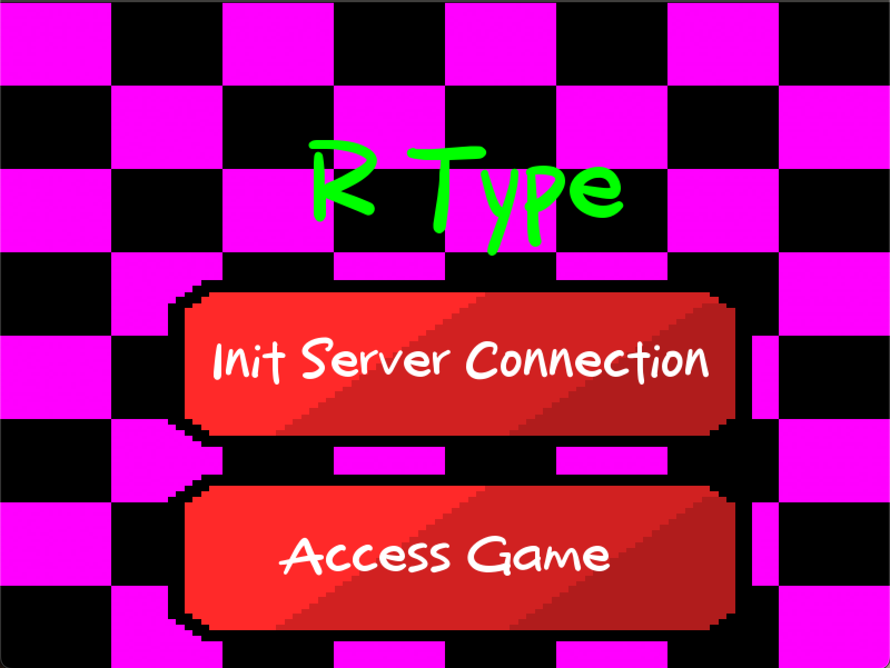
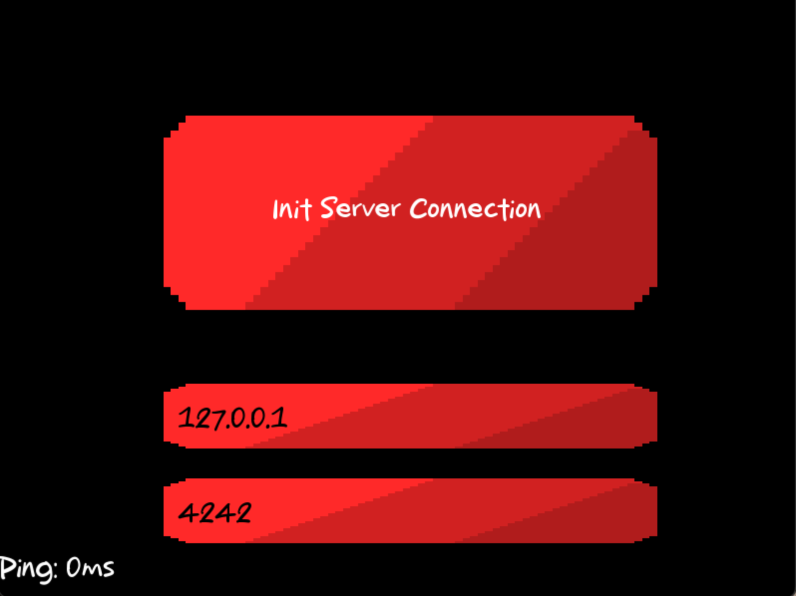
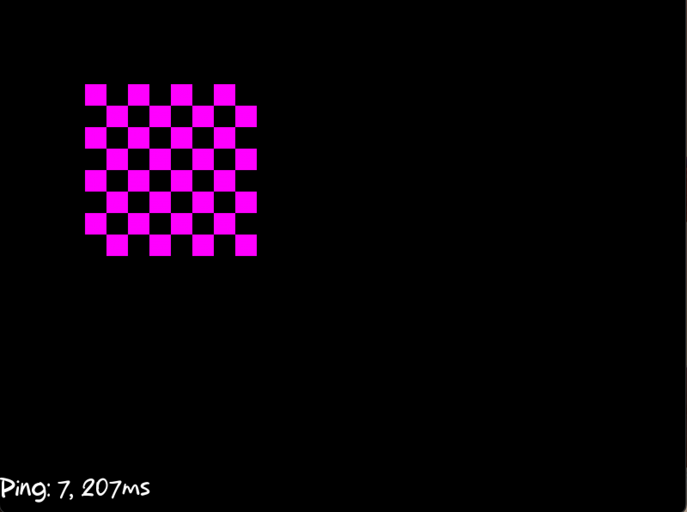

# R-TYPE [EPITECH PROJECT] [DOCUMENTATION]

<h1 align="center">
  
  <br>
</h1>

<a href="https://img.shields.io/badge/MADE%20WITH-SFML-brightgreen" alt="SFML">
        </a>
<a href="https://img.shields.io/badge/MADE%20WITH-C%2B%2B-ff69b4" alt="C++">
        </a>
<a href="https://img.shields.io/badge/MADE%20WITH-CMAKE-red" alt="Cmake">
        </a>

## Introduction

For this Advanced C ++ Knowledge Unit project, R-Type will present the development of network video games. 
Implementation of a multi-threaded server and a graphical client, using a reusable game engine of our own design. 
The game should also be fun to play! 
The purpose of this project is to create a one-to-four player game, using a client/server architecture.
This is important. It MUST be a client/server architecture. Peer-to-peer communication is not allowed.

## Goal of the project

The goal of this project is to create a multi-player video game based on the rules of the R-Type game. 
The game must be playable in local and network mode. 
The game must be composed of a server and a client. 
The server must be able to manage several simultaneous game rooms. 
The client must be able to display the game in real time. 
The client and the server must be able to communicate using the UDP protocol. 
The server and the client must be able to run on multiple operating systems (Windows, Linux, MacOS).

## Installation

### Clone the repository

```bash
git clone git@github.com:EpitechPromo2026/B-CPP-500-LIL-5-2-rtype-david.plouvier.git
```

### Build the project

```bash
mkdir build && cd build
cmake .. && make
```

## Usage

### Server

To launch the server, you need to run the following command:
```bash
./rtype_server
```

### Client

To launch the client, you need to run the following command:
```bash
./rtype_client
```

Once the binary is launched, you will come to this page:



On this page, click on the "Init Server Connection", you will come to this page:



On this page, you can enter the IP address of the server and the port you want to connect to.
Once the connection is established, you will see it on the page like this


Now you can click on "esc" on your keyboard to go back to the main menu and click on "Access Game" to join the server and you will come to this page and enjoy the game.

